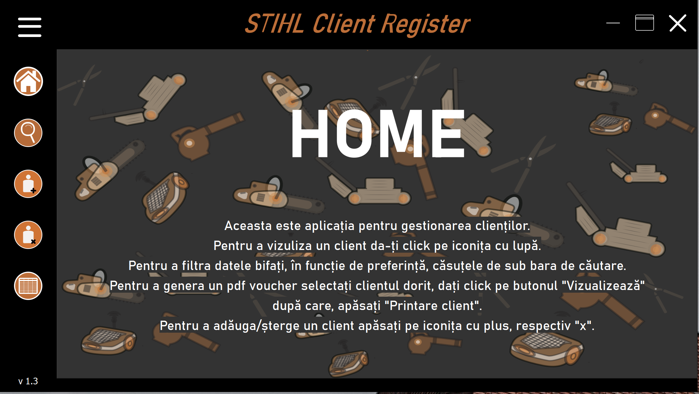
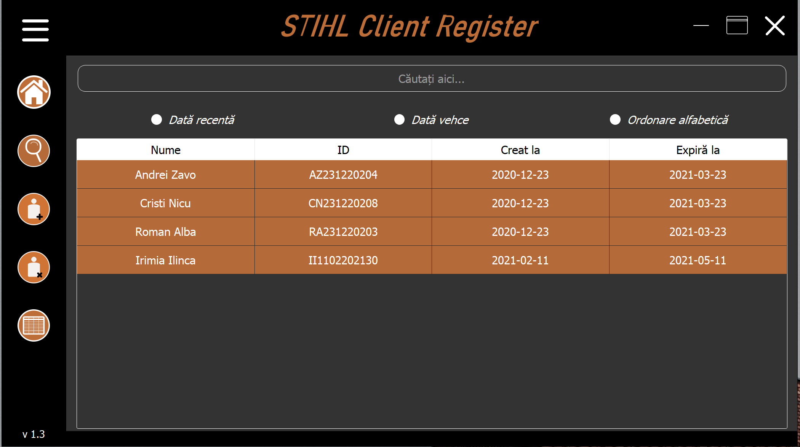
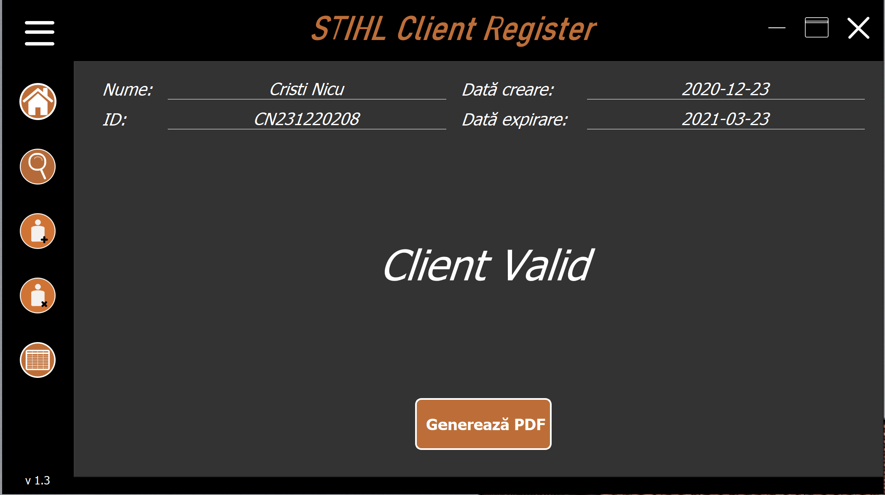
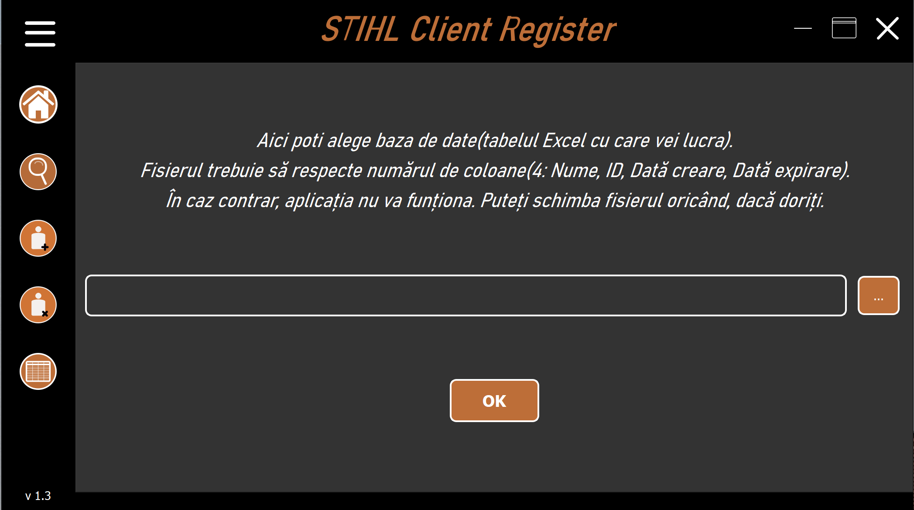
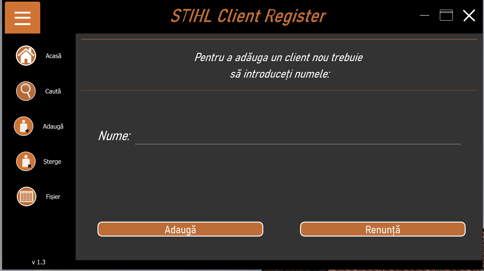
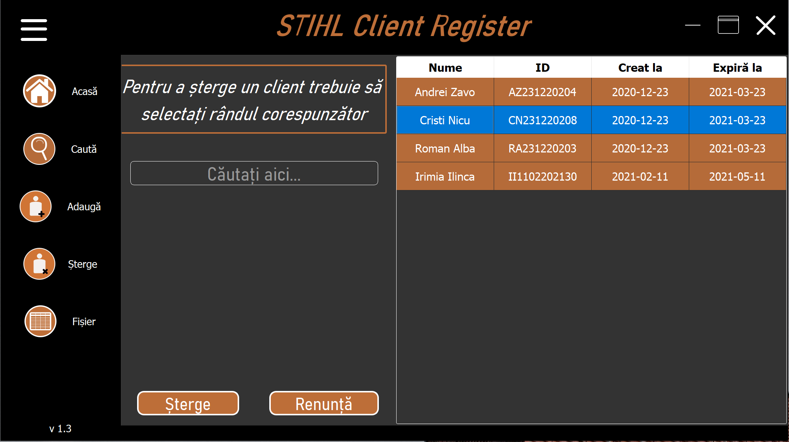

# STIHL- Client Managment Application

  

<h3> CRUD Database managment desktop application built with Python and Qt framework </h3>

* [General info](#general-info)
* [Features](#features)
* [Screenshots](#screenshots)
* [Technologies](#technologies)

---
## General info
 This application is meant to speed up and to render the managment of a great deal of clients. 
 The user can find in a matter of seconds a client's information not just due to the sorting feature and filter options, but can also scan his designeted barcode and his credentials will appear instantly. 
 Moreover, when a new client is beeing added to the database, he will receive a voucher in the form of a PDF on which he has his unique barcode.
 I construct it entirely with Python and at the user interface level I used Qt framework which I connected afterwords with Python.  

---
## Features
  * Create--Read--Update--Delete a client
  * Generate PDF with unique client's data
  * Generate a barcode representing the id of the client
  * Choose a database(an Excel file) from local device to use in the application
  * Various animations(hover, fade-in/fade-out, slides, etc.)
  * Resize buttons and strech option

---
## Screenshots

<table style="margin-left:auto;margin-right:auto;">
  <tr>
   <td>  </td>
   <td>  </td>
 </tr>
  <tr>
   <td>  </td>
   <td>  </td>
 </tr>
 <tr>
  <td>  </td>
  <td>  </td>
 </tr>
 
</table>

---
 ## Technologies
  * Backend --> Python 3.9
  * UI Design --> Qt Design
  * Images and Icons --> Illustrator

---
#### Thank you note
I appreciate you reading this far. I have really been putting my heart and soul into this project especially that I needed to manage the work at the University too.
It is my first personal project of this sizes but certantly not the last 😉
